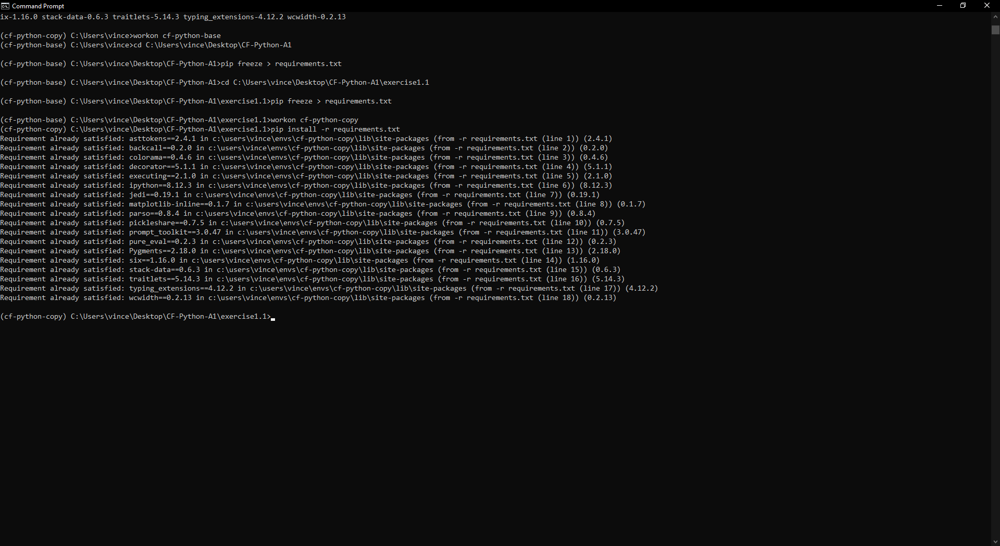

# Table of Contents

1. [Exercise 1](#exercise-1)
2. [Exercise 2](#exercise-2)
3. [Exercise 3](#exercise-3)
4. [Exercise 4 Part 1](#exercise-4-part-1)
5. [Exercise 4 Part 2](#exercise-4-part-2)
6. [Exercise 4 Part 3](#exercise-4-part-3)
7. [Exercise 5](#exercise-5)
8. [Exercise 6 Part 1](#exercise-6-part-1)
9. [Exercise 6 Part 2](#exercise-6-part-2)
10. [Exercise 6 Part 3](#exercise-6-part-3)
11. [Exercise 6 Part 4](#exercise-6-part-4)
12. [Exercise 6 Part 5](#exercise-6-part-5)
13. [Exercise 6 Part 6](#exercise-6-part-6)
14. [Exercise 6 Part 7](#exercise-6-part-7)
15. [Exercise 7 Part 1](#exercise-7-part-1)
16. [Exercise 7 Part 2](#exercise-7-part-2)
17. [Exercise 7 Part 3](#exercise-7-part-3)
18. [Exercise 7 Part 4](#exercise-7-part-4)
19. [Exercise 7 Part 5](#exercise-7-part-5)

# Exercise 1

## Table of Contents

1. [Install Python](#install-python)
2. [Set Up a Virtual Environment](#set-up-a-virtual-environment)
3. [Create a Python Script](#create-a-python-script)
4. [Set Up IPython Shell](#set-up-ipython-shell)
5. [Export a Requirements File](#export-a-requirements-file)
6. [Create a Github Repo](#create-a-github-repo)

## Install Python

First, install Python 3.8.7 on your system. Check your Python version by using the command `python --version` from your terminal.


## Set Up a Virtual Environment

Set up a new virtual environment named “cf-python-base”.


## Create a Python Script

Install Visual Studio Code or another text editor of your choice and create a Python script named “add.py”. This script will take two numbers from the user input, add them, and print the result. Here's the template for your Python script:


```python
# Prompt the user to enter the first number
a = int(input("Enter the first number: "))

# Prompt the user to enter the second number
b = int(input("Enter the second number: "))

# Add the two numbers and store the result in variable c
c = a + b

# Print the value of c
print("The sum of", a, "and", b, "is:", c)
```

## Set Up IPython Shell

Set up an iPython shell in the virtual environment "cf-python-base". An IPython shell is similar to the regular Python REPL with additional features like syntax highlighting, auto-indentation, and robust auto-complete features. Install it using pip.


## Export a Requirements File

Generate a “requirements.txt” file from your source environment. Next, create a new environment called “cf-python-copy”. In this new environment, install packages from the “requirements.txt” file.



# Exercise 2

## Table of Contents

1. [Create the Data Structure](#create-the-data-structure)
2. [Create recipe_1](#create-recipe_1)
3. [Create Outer Structure](#create-outer-structure)
4. [Create 4 More Recipes](#create-4-more-recipes)
5. [Print Ingredient Lists](#print-ingredient-lists)

## Create the Data Structure

- Create a structure named recipe_1 that contains the following keys:
  - name (str): Contains the name of the recipe
  - cooking_time (int): Contains the cooking time in minutes
  - ingredients (list): Contains a number of ingredients, each of the str data type


_A dictionary is well-suited because it offers a key-value structure to link recipe attributes, making it simple to retrieve specific details using keys. It can store various data types, such as strings for the recipe name, integers for cooking time, and lists for ingredients. This structure ensures organization and consistency, which is especially beneficial when managing multiple recipes within a list. In summary, a dictionary allows for easy manipulation and structured access to recipe information, supporting further processing and analysis efficiently._

## Create recipe_1


## Create outer Structure

Create an outer structure called all_recipes, and then add recipe_1 to it.


_A list offers a flexible and dynamic structure, allowing for easy updates and retrieval of recipes based on their sequence. With support for iteration and indexing, it facilitates efficient operations on both individual recipes and the whole collection. Lists can handle recipes of different lengths and complexities, making them adaptable to a wide variety of recipe formats. In summary, a list provides the scalability, flexibility, and accessibility needed for effectively managing and modifying multiple recipes._

## Create 4 More Recipes

Generate 4 more recipes as recipe_2, recipe_3, recipe_4, and recipe_5, and then add them as well to all_recipes.


## Print Ingredient Lists

Print the ingredients of each recipe as five different lists, inside the IPython shell.


